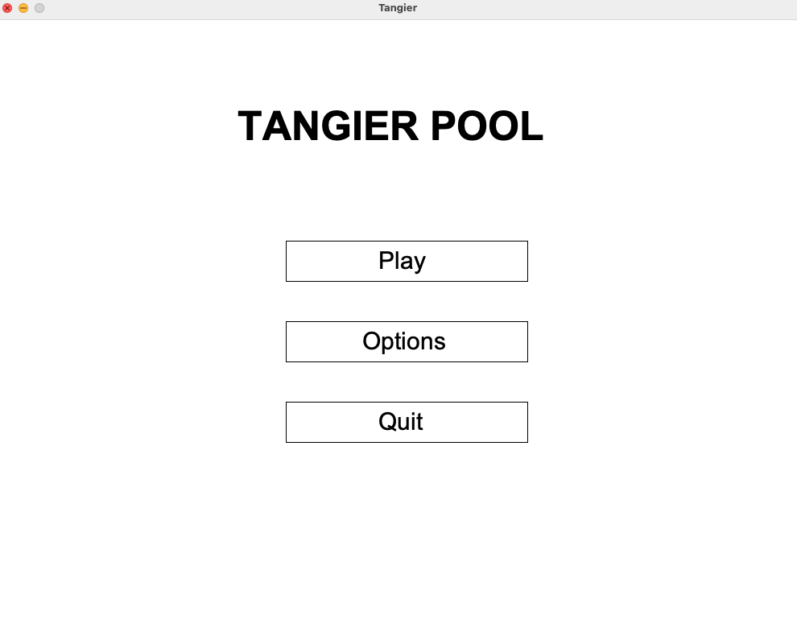
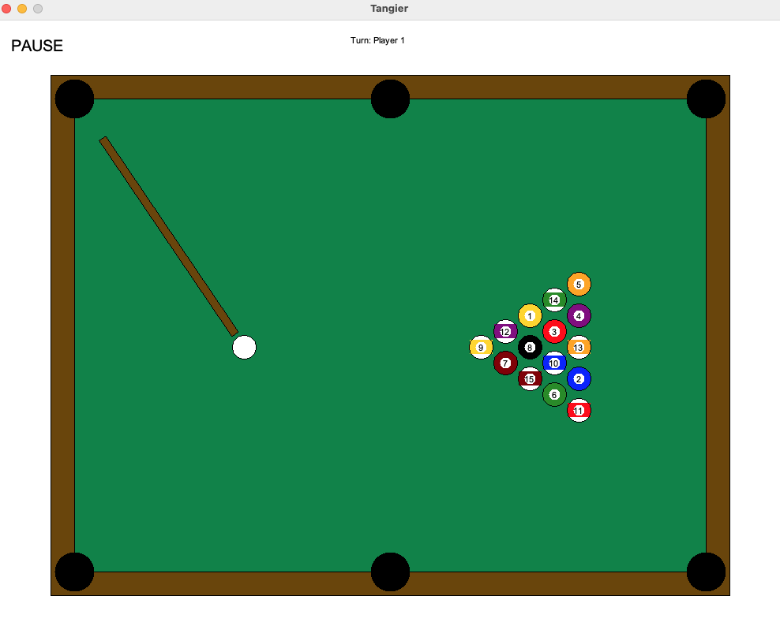
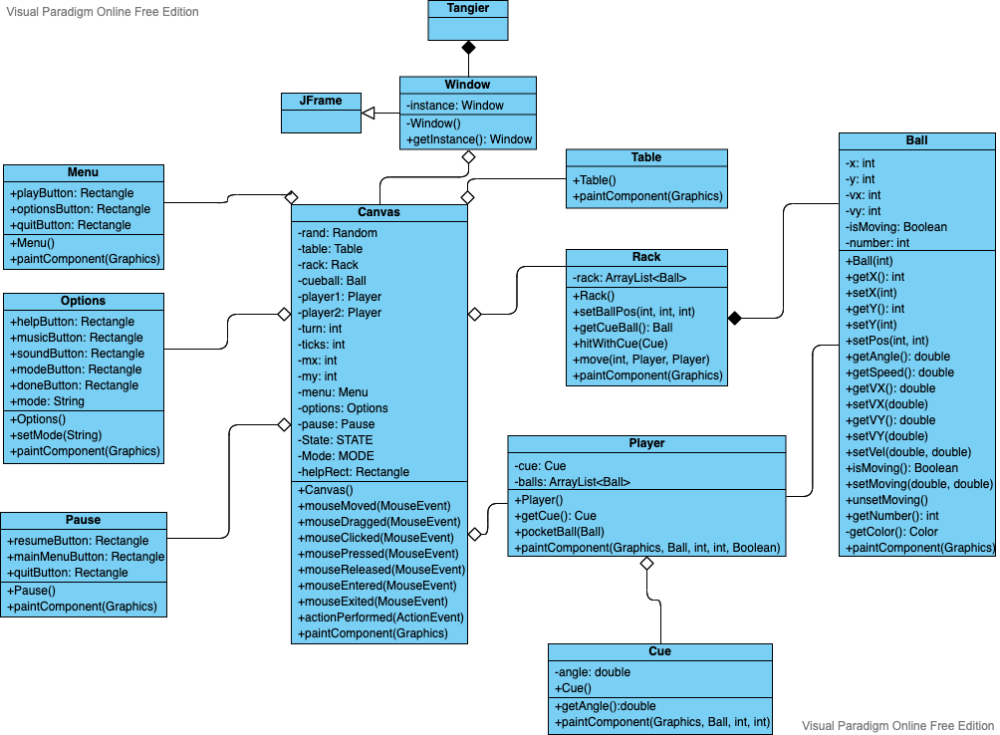

# tangier
A simple Java Swing based pool game.

## Integrantes

- Claudia Constanza Paz Cser Muñoz
- Leonardo Enrique Lovera Emanuelli

## Tema 6: Mesa de Pool

- En el panel central, con vista aérea, deben aparecer bolas en posiciones randómicas, una blanca y otras de color.
- El taco debe aparecer automáticamente apuntando a la bola blanca y debe ser manejado con troles GUI (teclado y mouse), para golpear bola blanca.
- Las bolas deben tener la física de impactos, inercia y roce.
En las esquinas debe haber troneras donde pueden caer.
- La cantidad de bolas debe ser definible por interfaz GUI. Habrá bandas para rebote de las bolas y si caen en las troneras, otorgan puntos.
- Reiniciar se debe hacer por controles GUI. Si se cae la bola de color y la blanca no hay puntaje, si cae la blanca se resta puntaje. 

### Modificaciones de la propuesta

- Se realizó un menú interactivo que permite jugar, pausar y modificar las opciones del juego, además contempla una sección de ayuda.
- Se realizó una partida con 2 jugadores, uno que obtiene puntos cuando se meten bolas lisas en las troneras, y otro que obtiene al insertar bolas rayadas. El puntaje se representa colocando la pelota insertada del lado izquierdo o derecho, indicando si el punto fue para el primer o el segundo jugador.
- También, se decidió no eliminar puntos al meter la bola blanca, pues según nuestra investigación, esto no es parte de las reglas estándar del juego.
- Además, existe la opción de colocar las pelotas en forma pirámidal (como normalmente se juega) o que las bolas aparezcan randómicamente al iniciar el juego.

### "Gajes del oficio"

- Nos costó un montón comprender con profundidad cómo funcionaban las interfaces de Listeners y cómo hacer que los Timers actualizaran todo con la velocidad y eficiencia que esperábamos.
- Hacer que el taco apuntara a la bola blanca fue muy divertido y desafiante, tuvimos que utilizar muchas herramientas para que pudiera mantenerse centrado en la bola y que rotara cuando el mouse se moviera.
- Queríamos implementar un sistema de "tiza" que hiciera el tiro del taco menos preciso, pero cuando se implementó, el juego se volvía demasiado complicado y no era placentero jugarlo, así que por mucho que nos gustara la idea no pudimos hacer algo que satisfaciera nuestro ideal.
- Para realizar el proyecto no usamos mucho NetBeans, lo agregamos como último commit para mantener el consenso del curso y pusimos todas las clases en un solo paquete. Invitamos a ver la versión inmediatamente anterior para que vean que separamos las clases en 3, assets, menu y gui. Esto lo compilábamos y ejecutábamos con un Makefile.
- A pesar de todo esto, estamos muy complacidos con el resultado del proyecto y comentamos que aprendimos a trabajar en paralelo eficientemente.

### Patrones utilizados

En la clase Window se utilizó un patrón Singleton, utilizando un constructor privado y que solo existiera una instancia de esta clase, pues durante todo el juego solamente habrá una ventana.

### Captura de la interfaz

### Diagrama de casos de uso

### Diagrama UML

